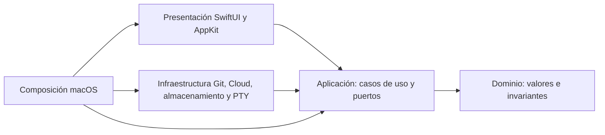

# Arquitectura de EfbyGitDesk

Versión 0.1 · 6 de octubre de 2026 · Especificación propuesta, sin implementación.

## 1. Objetivo y decisiones

EfbyGitDesk será una aplicación exclusivamente para macOS, conectada con Bitbucket Cloud. Clean Architecture es obligatoria: dominio y casos de uso no dependen de SwiftUI, AppKit, Git CLI, HTTP, SQLite, Keychain ni del emulador de terminal. La edición del mensaje del último commit publicado forma parte del alcance aprobado.

Se propone Swift 6.2 o superior, SwiftUI con Observation, AppKit para integración nativa y Git instalado en el equipo. El terminal requiere una sesión PTY; SwiftTerm es una dependencia candidata detrás de contratos propios, pendiente de evaluación y aprobación en H0. SQLite del sistema almacena metadatos y Security Keychain protege secretos. macOS 14 o superior y distribución universal arm64/x86_64 son propuestas que H0 debe validar; no son requisitos confirmados por el usuario.

La solución funciona en un proceso de aplicación con subprocesos Git y shell. XPC podría estudiarse después si aparece una necesidad concreta de aislamiento. No se necesita un daemon privilegiado. Versiones de herramientas y dependencias se fijarán tras el prototipo; esta documentación no instala ninguna biblioteca.

## 2. Capas y dependencias

| Capa | Responsabilidad | Dependencias permitidas |
|---|---|---|
| Dominio | Entidades, valores e invariantes: comparación A/B, confianza, ramas y planes de edición | Swift; valores neutrales de Foundation cuando sean útiles |
| Aplicación | Casos de uso, puertos, coordinación, errores y eventos | Dominio y utilidades neutrales |
| Infraestructura | Git CLI, Bitbucket Cloud, SQLite, Keychain, vigilancia y transporte PTY | Aplicación y dominio |
| Presentación | Pantallas, modelos observables, grafo, diff y puente AppKit del terminal | Aplicación, dominio y componentes visuales encapsulados |
| Composición | Instanciación, inyección y ciclo de vida macOS | Todas las capas, exclusivamente para ensamblarlas |

Los protocolos de salida pertenecen a aplicación; infraestructura los implementa. Las vistas llaman casos de uso mediante modelos de presentación. Dominio no contiene `Process`, acceso a archivos, tipos HTTP ni vistas. Una validación visual nunca sustituye la comprobación del caso de uso.



Las flechas representan dependencias de código. La ejecución cruza puertos sin invertirlas. El emulador y su vista quedan encapsulados en un componente de terminal; ningún tipo de SwiftTerm aparece en los contratos interiores.

## 3. Aislamiento y presentación nativa

Los modelos de presentación usan Observation y `@MainActor` para publicar estado de ventana. Mantienen selección, filtros y navegación, no reglas Git. Los casos de uso reciben valores y devuelven resultados o eventos tipados. Los paquetes interiores evitan aislamiento accidental al actor principal.

El estado mutable compartido se encapsula en actores: coordinador de repositorios, cola de operaciones, sesiones y almacenamiento. Las transferencias entre aislamientos usan valores `Sendable`; objetos de proceso, conexiones SQLite y vistas permanecen dentro de su propietario. No se elimina una advertencia de concurrencia con `@unchecked Sendable` sin justificar y comprobar su contrato.

`async` no desplaza por sí solo trabajo al fondo: una tarea creada desde el actor principal puede heredar su aislamiento. El parseo voluminoso, cálculo de carriles del grafo y tratamiento de diff se programan fuera de él, con tareas acotadas y cancelación propagada. El hilo de interfaz no espera procesos ni realiza lecturas bloqueantes. Las actualizaciones de progreso se agrupan para evitar saturarlo.

El terminal AppKit se integra con SwiftUI mediante `NSViewRepresentable`. La vista tiene identidad estable por sesión; cambios de tamaño y reevaluaciones de SwiftUI no crean otra shell. `updateNSView` aplica configuración; el coordinador gestiona delegados y suscripciones. `dismantleNSView` libera observadores y recursos de la vista sin confundir desmontaje visual con una orden del usuario de terminar la sesión. [NSViewRepresentable, Apple](https://developer.apple.com/documentation/SwiftUI/NSViewRepresentable).

## 4. Módulos funcionales

| Módulo | Responsabilidad |
|---|---|
| RepositoryCatalog | Registro de rutas, favoritos, grupos, recientes y duplicados |
| RepositoryTrust | Inspección segura y habilitación de capacidades tras confiar |
| ProviderConnections | Perfiles y pruebas separadas para Git y API |
| CloneRepository | Transporte autorizado, clonación sin checkout, confianza y apertura |
| WorkingCopy | Estado, preparación por archivo y creación de commits |
| Branches | Referencias, creación, checkout y seguimiento |
| Synchronization | Fetch, pull ff-only predeterminado y push de rama |
| History | Historial paginado, padres, referencias y SHA completo |
| Comparison | Exactamente dos OID distintos, A base y B destino, intercambio explícito |
| AmendMessage | Plan de modificación de HEAD y publicación protegida |
| Terminal | Sesión, entrada, salida, tamaño y cierre |
| Operations | Cola, progreso, cancelación y reconciliación |

Bitbucket Cloud es el único proveedor de esta versión. El adaptador API interpreta recursos y errores Cloud; el adaptador Git opera repositorios independientemente del catálogo remoto. SSH habilita transporte Git, no acceso API. Perfiles heredados reutilizan configuración y auxiliares existentes sin extraer secretos.

## 5. Git y ejecución de procesos

`GitRepositoryPort` expresa operaciones de negocio; un ejecutor interno construye argumentos para el binario Git verificado, con directorio y entorno controlados. No concatena rutas, mensajes o nombres en una orden de shell. El terminal es el espacio donde el usuario puede introducir comandos arbitrarios; esa capacidad no se expone mediante los puertos Git.

Foundation `Process` permite ejecutar subprocesos y conectar entrada/salida. El adaptador combina su ciclo de vida con pipes y lectura asíncrona. Debe drenar stdout y stderr simultáneamente durante la ejecución, registrar el código de salida y cerrar descriptores al finalizar; esperar primero o consumir un solo canal puede bloquear procesos con salida abundante. Streams y buffers son acotados; el truncamiento visible no elimina datos necesarios para interpretar el resultado. [Process, Apple](https://developer.apple.com/documentation/foundation/process).

Las operaciones gráficas controlan pagers, editores y peticiones interactivas. La autenticación se resuelve por auxiliares o un mecanismo dedicado, sin introducir tokens en argumentos ni registros. El ejecutor distingue modo de inspección y modo confiado. Abrir una carpeta nueva permite inspeccionar objetos e historial seguros; no inicia terminal, red ni evaluación del estado de trabajo antes de confiar. Clonar es un transporte explícitamente autorizado con hooks deshabilitados y `--no-checkout`; la confianza precede al checkout y a filtros. El contrato detallado de confianza y credenciales está en el documento de seguridad.

## 6. Concurrencia y cambios externos

Cada worktree tiene identidad propia; los que comparten repositorio se agrupan por un `commonGitDir` canónico. Una cola FIFO de mutaciones por ese identificador coordina referencias, índices y operaciones de red iniciadas por EfbyGitDesk. Clone reserva su destino. Un actor protege la cola, pero no garantiza exclusión durante un `await`: un permiso de operación explícito se conserva hasta finalizar y se libera incluso ante fallo o cancelación.

Las lecturas devuelven una generación de estado. Si termina una consulta anterior a un cambio, se descarta o recalcula su resultado. Una operación revalida sus precondiciones inmediatamente antes de modificar: HEAD, índice, rama y referencia remota cuando corresponda. Un plan de amend publicado conserva el OID remoto esperado y detiene la publicación si cambia; no existe un force push ciego.

Terminal, IDE y otros clientes actúan fuera de la cola. Los locks de Git siguen siendo la autoridad; nunca se elimina automáticamente un `index.lock`. Un watcher con debounce observa cambios relevantes, complementado por refresco al recuperar foco, al finalizar operaciones y bajo demanda. Los eventos invalidan instantáneas y planes; no prueban por sí solos que una operación externa haya terminado. Se reconcilia consultando Git.

Las acciones incompatibles se deshabilitan con explicación mientras trabaja la cola. Si ya existen conflictos o un pull ff-only encuentra divergencia, se presentan estado, archivos afectados y orientación para el terminal. La primera versión no incorpora asistentes gráficos de merge/rebase.

## 7. Terminal y recursos

`TerminalPort` define inicio, entrada, salida, cambio de dimensiones y cierre; su sesión se identifica independientemente de la vista. El transporte PTY resuelve tamaño, señales y shell interactiva. Los pipes utilizados para Git no sustituyen una PTY.

SwiftTerm ofrece un emulador y vistas AppKit, incluida una vista conectada a proceso local. H0 determinará si esa integración permite mantener las fronteras y el ciclo de vida requeridos, o si conviene conectar su vista al transporte propio. Se comprobarán Unicode, pegado, redimensionamiento, VoiceOver, consumo, señales y compatibilidad del instalador antes de aprobar versión/licencia e incorporarlo. [Proyecto SwiftTerm](https://github.com/migueldeicaza/SwiftTerm).

Cada repositorio conserva su contexto de trabajo y sus sesiones. Contraer el panel no las reinicia. Cerrar una sesión libera PTY, procesos, handlers y buffers; cerrar solo la vista elimina suscripciones visuales. Al cerrar la aplicación con procesos activos se presenta su estado y la posibilidad de esperar. No se relanzan shells o mutaciones automáticamente tras un fallo.

## 8. Persistencia, errores y recuperación

SQLite conserva catálogo, grupos, favoritos, perfiles sin secretos, preferencias y registro mínimo de operaciones. Un adaptador aislado ejecuta transacciones y migraciones versionadas; las migraciones incompatibles requieren una copia de recuperación. Las cachés de historial/diff son descartables, acotadas y asociadas a OID completos y opciones. Git es la fuente de verdad para archivos, commits, referencias e índice; EfbyGitDesk no escribe directamente en `.git` para simular operaciones.

El puerto de secretos se implementa con Security Keychain. La base guarda referencias a entradas, nunca el token. El formulario conserva la entrada sensible solo durante su envío; los secretos recuperados para operaciones no regresan a modelos de interfaz ni logs. El usuario puede retirar la conexión local sin borrar material SSH de su configuración. [Keychain services, Apple](https://developer.apple.com/documentation/security/keychain-services).

Los adaptadores traducen fallos a códigos estables con contexto seguro. Estados: `queued`, `running`, `awaitingUser`, `succeeded`, `failed`, `cancelled` e `interrupted`. Cancelar una `Task` se propaga al subproceso o sesión administrada, espera su terminación dentro de límites y reconcilia Git; no significa revertir cambios. En amend se distingue mensaje modificado localmente de publicación pendiente. Al reiniciar, operaciones inconclusas quedan interrumpidas y se verifica estado antes de ofrecer recuperación.

## 9. Proyecto y distribución

```text
EfbyGitDeskApp/                   # composición y ciclo de vida macOS
Packages/
  EfbyGitDeskDomain/              # entidades y reglas puras
  EfbyGitDeskApplication/         # casos de uso, puertos y eventos
  EfbyGitDeskPresentation/        # features SwiftUI y modelos observables
  EfbyGitDeskGit/                 # Process, parsing y watcher
  EfbyGitDeskBitbucketCloud/      # HTTP y traducción de recursos
  EfbyGitDeskStorage/             # SQLite y migraciones
  EfbyGitDeskSecrets/             # Security Keychain
  EfbyGitDeskTerminal/            # adaptador PTY y puente visual encapsulado
Tests/Fixtures/              # repositorios sintéticos
Docs/                        # especificaciones y decisiones
```

Los módulos se expresan con paquetes/targets Swift y dependencias hacia dentro. No se necesita un paquete por cada caso de uso. Presentación se organiza por features; sus modelos importan aplicación, nunca el ejecutor Git concreto. Composición es el único lugar que escoge adaptadores reales o falsos.

Se propone distribución fuera de Mac App Store, firmada con Developer ID, Hardened Runtime y notarización, sin App Sandbox para soportar terminal y herramientas heredadas. H0 valida entitlements, ejecución de procesos y ambas arquitecturas en el paquete distribuido. Se solicitan únicamente permisos de privacidad necesarios mediante macOS; no se pide acceso completo al disco por defecto. La firma/notarización no equivalen a habilitar permisos de archivos. [Notarización de software macOS, Apple](https://developer.apple.com/documentation/security/notarizing-macos-software-before-distribution).

## 10. Validación progresiva de arquitectura

H0 comprueba límites de importación, aislamiento Swift, ejecución Git con salida intensa, cancelación, terminal PTY estable y acceso a Keychain desde una aplicación firmada instalada. En los hitos siguientes se añaden adaptadores falsos, invalidación por cambios externos, historial paginado, comparación limitada a dos OID, confianza sin scripts y edición de mensaje sin incorporar cambios preparados. La aceptación completa sigue la matriz QA antes de H6. Las propuestas pendientes y sus riesgos se registran en `10-decisiones-riesgos-y-fuentes.md`.
