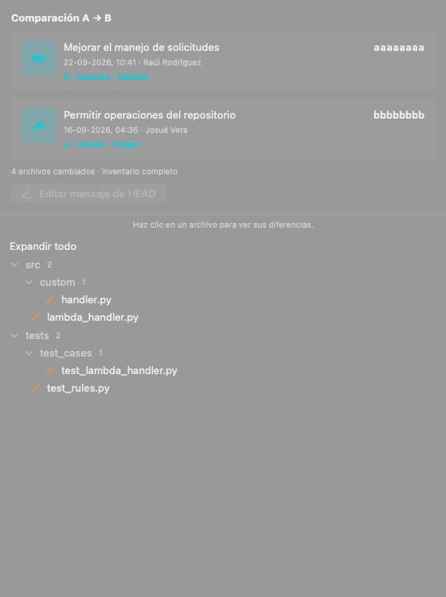
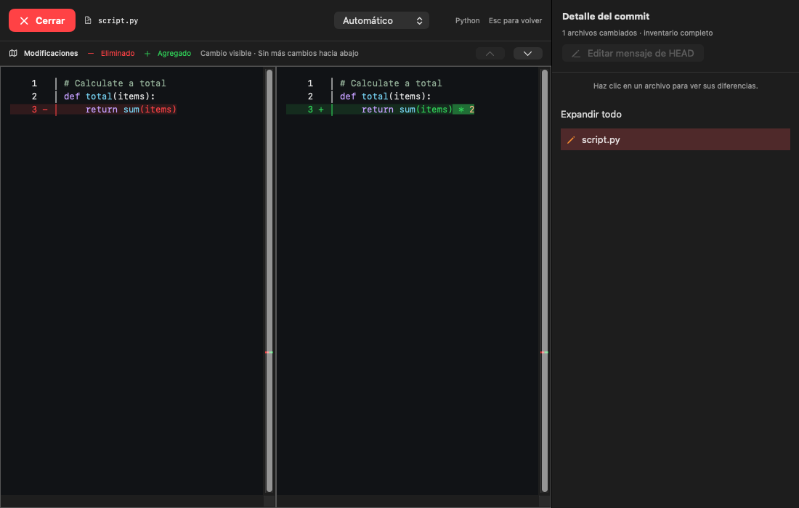

# EFBY Git Desk — resumen del proyecto y continuidad

Corte documental: **7 de octubre de 2026**, código integrado hasta `5e26fd3`
(merge del PR #7). Este documento consolida el comportamiento vigente y permite
retomar el proyecto sin reconstruir conversaciones. Los estados remotos son
los observados durante esta actualización; pueden cambiar después.

## Identidad, alcance y fuentes

- Nombre visible: **EFBY Git Desk**. Proyecto, package y módulos: `EfbyGitDesk`.
- Repositorio de desarrollo: [efby/EFBY-GIT-DESK](https://github.com/efby/EFBY-GIT-DESK).
- Aplicación nativa solo macOS; integración gestionada inicial con Bitbucket Cloud.
  GitHub aloja el desarrollo y distribución; no supone integración GitHub en la app.
- Clean Architecture obligatoria; Git es fuente de verdad de archivos y referencias.
- La documentación 01–10 conserva requisitos, diseño base, contratos y aceptación.
  [11](11-estado-mvp.md) registra la evolución y resultados históricos.
  [12](12-dmg-y-github-actions.md) es la guía de firma, notarización y Actions.
- El espejo de ChatGPT conserva su identidad EfbyGitControl. Sus `sources/` y
  referencias sincronizadas no se modificaron; el desarrollo y esta documentación
  versionada viven en `EFBY-GIT-DESK/`. Hay una copia auxiliar de trabajo para PR.

## Arquitectura implementada

| Capa / módulo | Responsabilidad |
|---|---|
| EfbyGitDeskDomain | Valores Git, repositorios, commits, comparación y sus invariantes |
| EfbyGitDeskApplication | Casos de uso, puertos, confianza, coordinación y planes de operación |
| EfbyGitDeskInfrastructure | Git CLI, procesos, SQLite, Keychain, Bitbucket REST y PTY |
| EfbyGitDeskPresentation | SwiftUI/Observation, modelos MainActor y controles AppKit |
| EfbyGitDeskApp | Composición e inyección de adaptadores |
| EfbyGitDeskCredential | Helper de credenciales con referencias a secretos |

Swift 6 con concurrencia estricta; SwiftUI y AppKit para paneles, texto y terminal.
SQLite y frameworks del sistema; no se añadieron frameworks de terceros ni
SwiftTerm. El terminal es un PTY propio con soporte VT básico. Swift 6.4 fue
verificado localmente; Actions utilizó Xcode 26.5/Swift 6.3.2 en ensayos registrados.
El mínimo de compilación es macOS 14. App y auxiliar se generan arm64/x86_64,
sin atribuir por ello ejecución comprobada en Intel/macOS 14.

## Funciones del MVP

El registro local permite repositorios, pestañas, favoritos, grupos, recientes,
confianza y preferencias persistidas. Abrir una carpeta superior descubre proyectos
Git en sus subcarpetas y construye un árbol navegable. La búsqueda encuentra
repositorios por nombre, ruta o grupo aun con carpetas contraídas. El descubrimiento
no concede confianza ni ejecuta hooks; informa resultados parciales y permite cancelar.

El workspace ocupa el área disponible incluso sin seleccionar commits. Las acciones
se presentan en pestañas **Pendientes**, **Preparados** e **Historial**, con contadores;
las ramas están en el menú **Ramas**, sin el antiguo lateral de área de trabajo.
Los paneles son redimensionables y recuerdan ancho. Los valores iniciales registrados
son 340 puntos para comparación y lateral; el mínimo del lateral es 210. El visor
reserva espacio para documentos y el navegador de archivos según tamaño disponible.

Se implementaron ramas, staging por archivo, commit del índice, fetch, pull solo
fast-forward y push con destino explícito. Historial paginado, grafo, búsqueda y SHA
completo. Clonación sin checkout, seguida de confianza antes de materializar archivos.
Tokens en Keychain y transporte SSH/helpers heredados, separados del catálogo REST.

Editar el mensaje de HEAD crea recuperación y un plan de un solo uso que caduca a
los 60 segundos. Conserva árbol, padres y autor y revalida antes de escribir. Publicar
requiere tip remoto coincidente y lease con ref/OID esperado; sin force push genérico
ni rollback automático. La recuperación permanece ante fallos. La matriz RF-01…RF-16
y sus límites están en [11](11-estado-mvp.md); implementación no equivale a QA completo.

El terminal inferior conserva sesiones al ocultarse; admite directorio, resize,
Unicode y Ctrl+C. Refresca cambios al recuperar foco y periódicamente. No restaura
procesos vivos al reiniciar ni persiste su salida. Quitar registros conserva repositorios.

## Comparación y lectura de código

1. Seleccionar exactamente dos commits distintos. A es el inferior del historial y
   B el superior, independientemente del orden de clic. Un tercer clic conserva el par.
2. Comparar directamente sus árboles A→B, también entre ramas sin ancestro común;
   nunca sustituir por merge-base o triple punto.
3. Mostrar inventario; el diff se abre **solo al hacer clic en un archivo**.
4. El visor cubre la misma ventana de la app y conserva montado el workspace. No
   activa fullscreen de macOS. **Cerrar**, en rojo, o `Esc` recuperan la vista anterior.
5. El panel derecho permanece visible para cambiar de archivo sin cerrar el visor.

El panel derecho muestra tarjetas apiladas: B superior y A inferior, mensaje,
SHA copiable, fecha local y **autor del commit**. Git no registra quién hizo push.
Hay URL opcional para avatar, pero el adaptador local no obtiene fotos: actualmente
se usan iniciales. La integración de perfiles del proveedor sigue pendiente; no se
consulta Gravatar ni se envían correos a servicios externos para obtener imágenes.

Los archivos aparecen en árbol con carpetas desplegables, conteos, **Expandir todo**,
selección e iconos/color de añadido, eliminado, modificado o renombrado. Se conservan
bytes e identidades de rutas, incluso no UTF-8 y sustituciones archivo/directorio.
No se agregaron controles de ordenamiento ni selector Path/File. Las filas compactas
usan 3 puntos de padding vertical en lugar de 7, separación interna de carpeta 0
y raíz 1; se redujo margen del texto de ayuda y Expandir todo sin reducir la fuente.

Se retiraron las cabeceras duplicadas Documento 1/Documento 2, SHA y ruta sobre el
código, porque las tarjetas y la barra del archivo ya identifican el contexto.
El aviso de falta de salto de línea final sigue visible solo cuando corresponde.

Ambos documentos sincronizan scroll horizontal y vertical, con números originales
y huecos cuando no hay correspondencia. La barra **Modificaciones**, navegación al
cambio anterior/siguiente y distancia en líneas al próximo cambio se conservan.
La distancia hacia abajo se calcula desde el borde inferior visible. Cada columna
lleva un mapa vertical detrás del indicador de scroll: rojo eliminado, verde añadido.

Las líneas iguales, incluso desplazadas, no se marcan. La alineación usa anclas
únicas y matching exacto Myers acotado entre anclas, manteniendo el orden documental.
Si los bloques cruzan posiciones, no se fuerza un emparejamiento que cruce el orden.
Los límites y fallback explícito están en 11: 50.000 líneas combinadas, presupuesto
2.000.000 operaciones y 250.000 entradas de traza. No es equivalencia semántica.

Texto eliminado rojo y añadido verde. Las modificaciones de líneas existentes
resaltan solo los fragmentos cambiados en ambos lados; texto común queda sin marca.
Una línea totalmente nueva tiene fondo verde tenue y signo +, sin resaltado intenso
por fragmentos. El hueco del otro lado queda neutro. Una línea vacía existente que
recibe texto es una modificación. Se preservan sintaxis y selección manual.

El selector de formato detecta Python, JS/JSX, TS/TSX, Swift y otros lenguajes conocidos;
permite elección manual o texto plano. Es resaltado léxico, sin ejecutar código.
Binarios, LFS, enlaces, submódulos y contenido grande muestran resumen/límite; el
límite textual de 2 MB no debe convertirse en omisión silenciosa del inventario.

Capturas sintéticas revisadas, no sesiones de repositorios personales:

El icono conserva el logotipo y estilo de EFBY_POSTMAN, con etiqueta **#GitDesk**.
Fuentes y generación: `Resources/Brand/EfbyLogo.ai` y `scripts/generate-icon.sh`.

## Distribución y reglas del repositorio

Trabajar en ramas y PR; **no hacer push directo a main**. No se alteraron reglas de
protección del servidor: esta norma es parte del flujo de desarrollo acordado.

| Evento | Resultado |
|---|---|
| PR interno fusionado hacia main | Tests, firma, notarización, artefacto y Release |
| PR abierto/actualizado/cerrado sin merge | No genera DMG |
| Push a rama o tag | No genera DMG |
| Release DMG manual en main | Genera y publica Release |
| Release DMG manual en otra rama | Genera artefacto; no publica Release |
| Fork o Dependabot | Firma automática omitida; no ejecutar código externo con secretos |

Se compila el SHA del merge. App y auxiliar universales; firma Developer ID con
Hardened Runtime/timestamp; ZIP de la app aceptado por Apple, ticket de app adjunto;
DMG creado, aceptado y con ticket. Verificación estricta, checksum, montaje readonly,
enlace Applications, ticket de app montada y Gatekeeper antes de entregar. No se
re-firma el DMG ni se degrada a unsigned si faltan secretos. Guía operativa: [12](12-dmg-y-github-actions.md).

La publicación verifica checksum del artefacto descargado por su trabajo, crea tag
semántico sobre el SHA compilado y adjunta DMG/checksum con notas automáticas.
Primera versión v0.1.0; siguientes incrementan patch del mayor tag semántico,
respetando una versión base superior en Info.plist. APP_VERSION se aplica antes de
firmar. No reemplaza Releases existentes. El flujo se serializa sin cancelar el
trabajo activo. La escritura de contenido se limita al trabajo de publicación.

Secretos requeridos, **solo nombres**: MACOS_CERTIFICATE_P12_BASE64,
MACOS_CERTIFICATE_PASSWORD, APPLE_ID, APPLE_APP_SPECIFIC_PASSWORD, APPLE_TEAM_ID.
Los valores, .env, .p12, PEM y deploy keys permanecen fuera de Git. GitHub no permite
recuperar valores de secretos existentes. Se reutilizó el origen autorizado de
POSTMAN, aislando la identidad de distribución sin modificar el proyecto de referencia.

## Incidencias resueltas y evidencia

| Problema | Corrección / evidencia |
|---|---|
| Actions detenido después de Build complete! | ProcessJob bloqueaba hilos del ejecutor cooperativo de Swift. Dispatch concurrente + continuación async conserva cancelación/timeout/drenaje; regresión con 24 procesos y 128 KB. Build complete indica compilación, no tests aprobados. |
| Esperas indefinidas de CI | Supervisor con diagnóstico a 120 s y límite de 300 s, terminación del grupo de procesos propio; paso Tests con límite de 10 minutos. |
| Test de ventanas intermitente | Validar identidad de ventana/contenido propio, sin comparar NSApp.windows.count mientras otras suites crean ventanas. |
| PKCS12 RC2 no leído por OpenSSL 3 | Activar proveedor legacy al descifrar el contenedor existente; no cambiar verificación TLS. |
| SecKeychainItemImport rechazó /dev/stdin | Importar PEM completo desde directorio temporal 0700, archivos 0600; contraseña por entorno, eliminación inmediata, trap y limpieza final. |
| Credenciales Apple/acuerdo pendiente | El propietario aceptó el acuerdo y Apple validó credenciales; no se afirma que cambiar una contraseña resolviera ese problema. |
| DMG solo en Actions, sin Releases | Trabajo de publicación con tag, notas, checksum y asset DMG tras generación exitosa. |

Las ejecuciones inicialmente bloqueadas se cancelaron. Los intentos fallidos se
conservan en Actions y el registro 12, separados de las verificaciones exitosas.

- Suite local posterior a las tarjetas: **83 registradas, 81 aprobadas, 2 optativas
  omitidas, 19 suites, 6,439 s**. No atribuir ejecución de optativas a esa regresión.
- Ajuste de cabeceras: una prueba de overlay aprobada, 0,606 s; build/captura revisados.
- Árbol compacto: dos pruebas existentes aprobadas, 0,532 s; build/captura revisados.
- [Release DMG #8](https://github.com/efby/EFBY-GIT-DESK/actions/runs/37564003950):
  `7ed8af5`, compare actualizado y certificado corregido; generación 4m 5s,
  total 7m 48s con cola, tests/firma/notarización/verificación/subida correctos.
- [v0.1.0](https://github.com/efby/EFBY-GIT-DESK/releases/tag/v0.1.0): `c04bdd4`,
  PR #5; publicación automática verificada en [run 37564816832](https://github.com/efby/EFBY-GIT-DESK/actions/runs/37564816832).
- [v0.1.1](https://github.com/efby/EFBY-GIT-DESK/releases/tag/v0.1.1): `15ac933`,
  PR #6; publicación automática verificada en [run 37566099456](https://github.com/efby/EFBY-GIT-DESK/actions/runs/37566099456).
- [v0.1.2](https://github.com/efby/EFBY-GIT-DESK/releases/tag/v0.1.2): `5e26fd3`,
  PR #7; [run 37567560580](https://github.com/efby/EFBY-GIT-DESK/actions/runs/37567560580)
  terminó correctamente en 3m 10s. Generación 2m 50s y publicación 9s. DMG de
  3,43 MB y checksum presentes; última Release observada en este corte.

Resultados estructurados: [mvp-validacion.json](evidencia/mvp-validacion.json).
Los valores antiguos son snapshots de su etapa; las decisiones posteriores pueden
sustituirlos. El digest ZIP de Actions es distinto del digest del DMG de una Release.

## Pendientes y criterios de continuidad

Distribuir instaladores firmados no completa por sí solo H6. Permanecen abiertos:
cuenta real Bitbucket y ramas protegidas; helper Keychain en distribución; VoiceOver,
foco/teclado y restauración visual completos; instalación del artefacto descargado
en otro Mac; runtime Intel/macOS 14; terminal VT avanzado; avatares del proveedor;
matriz QA y objetivos de rendimiento completos (incluidos caché fría y p95).

No ampliar silenciosamente soporte de bare, sparse checkout, worktrees vinculados,
shallow/partial o submódulos. Los límites y restricciones actuales están en README/11.
La confianza precede working tree, terminal, red y mutaciones; operaciones avanzadas,
rewrite arbitrario, stash/rebase/merge automáticos y otros proveedores quedan fuera del MVP.

Para continuar: revisar este corte, consultar Git/PR/Actions reales, elegir historia
pequeña y actualizar comportamiento/evidencia/pendientes. Ejecutar pruebas pertinentes,
no sustituir evidencia histórica ni escribir secretos. Conservar originales sincronizados,
repositorios y recuperación. Dejar PR concreto para revisión; el merge activa distribución.
